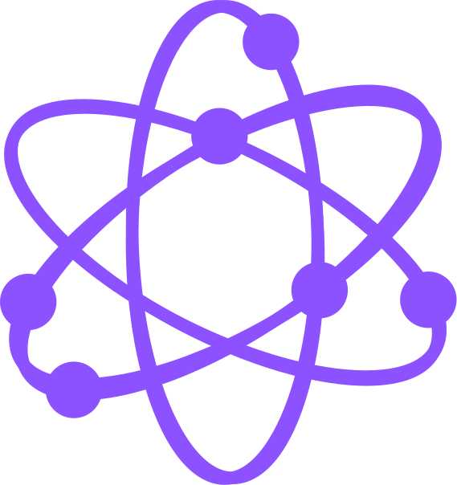

<h1>
<p align="center">Atomic State</p>
</h1>

<p align="center">

</p>

<p align="center">
 


</p>

<p align="center"> Atomic State is a minimalistic state managment library for React </p>

Getting started:

```
npm install --save atomic-state
```

Or with yarn:

```
yarn add --save atomic-state
```

[Getting started](https://www.atomic-state.com/get-started)
